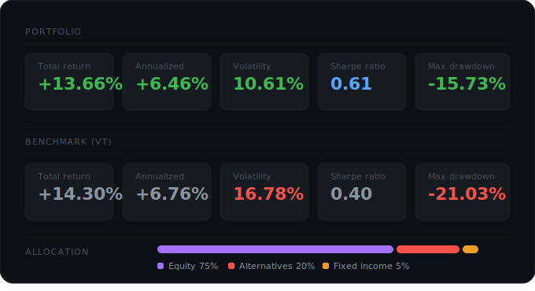

<h1>

    Quantitative Portfolio Analysis

</h1>

Quantitative analysis of a diversified investment portfolio over a two-year period, benchmarked against the FTSE Global All Cap Index (VT). The portfolio follows a long-term buy-and-hold strategy with rebalancing triggered by the **5/25 rule**. All prices are converted to CHF.

Portfolio positions are retrieved live from **Interactive Brokers** via the `ib_insync` API, and historical price data is sourced from **Yahoo Finance**.

## Results

### Cumulative Returns & Drawdown

## Privacy Notice

Actual portfolio holdings and weights are not included in this repository. The data in `portfolio_weights.json` is from a paper trading account for demonstration purposes only.
