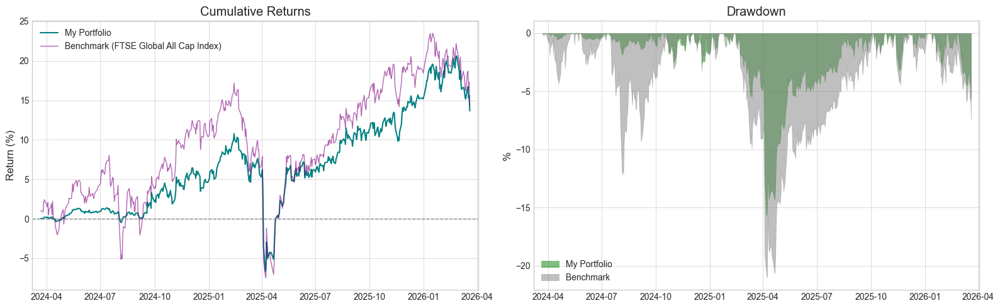

# Quantitative Portfolio Analysis

Quantitative analysis of a diversified investment portfolio over a two-year period, benchmarked against the FTSE Global All Cap Index (VT). The portfolio follows a long-term buy-and-hold strategy with rebalancing triggered by the **5/25 rule**. All prices are converted to CHF.

Portfolio positions are retrieved live from **Interactive Brokers** via the `ib_insync` API, and historical price data is sourced from **Yahoo Finance**.

## Results

### Portfolio Composition

| Asset Class | Allocation |
|---|---|
| Equity | ~75% |
| Fixed Income | ~5% |
| Alternatives | ~20% |

### Performance Metrics

| | Portfolio | Benchmark (VT) |
|---|---|---|
| Total Return | 13.66% | 14.30% |
| Annualized Return | 6.46% | 6.76% |
| Annualized Volatility | 10.61% | 16.78% |
| Sharpe Ratio | 0.61 | 0.40 |
| Max Drawdown | -15.73% | -21.03% |

### Cumulative Returns & Drawdown



## Project Structure

```
├── data/
│   ├── raw/                        # Raw price data
│   └── processed/
│       └── portfolio_weights.json  # Portfolio allocation weights
├── figures/
│   ├── cumr_and_drawdown.png       # Cumulative returns & drawdown plot
│   └── metrics.tex                 # LaTeX-formatted performance table
├── notebooks/
│   ├── get_portfolio_weights.ipynb  # Fetch positions from IBKR
│   └── portfolio_analysis.ipynb     # Performance & risk analysis
├── src/
│   └── portfolio_weights.py         # Helper for weight extraction
├── pyproject.toml
└── uv.lock
```

## Setup

Requires Python >= 3.12. Dependencies are managed with [uv](https://github.com/astral-sh/uv).

```bash
uv sync
```

## Privacy Notice

Actual portfolio holdings and weights are not included in this repository. The data in `portfolio_weights.json` is from a paper trading account for demonstration purposes only.
